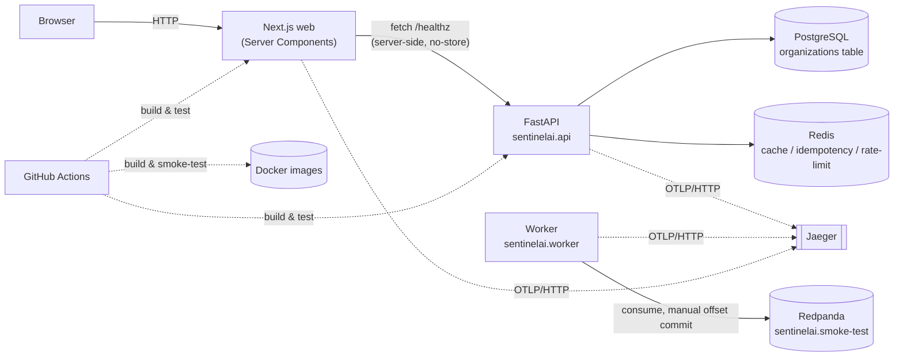

# Architecture — as built (through Milestone 1)

This document describes what exists in this repository *today*. For the
target system and the roadmap to get there, see [`HLD.md`](HLD.md). For why
specific choices were made, see [`adr/`](adr/).

## Runtime topology



Milestone 0 was a walking skeleton with no real domain logic. Milestone 1
adds the first one: services can be registered, and metrics/logs/deployments
can be ingested for them. Postgres now holds six tables (`organizations`,
`services`, `metric_samples`, `log_events`, `deployments`,
`alembic_version`); Kafka still carries only the M0 smoke-test topic — no
domain events are published yet (see ADR-0002; M2 is where that changes,
once detection is a real consumer).

## Repository layout

```
src/sentinelai/
  model_registry.py   imports every module's models for their Base.metadata
                       side effect — see "A gap found the hard way" below
  platform/     cross-cutting infra: config, logging, tracing, db, redis,
                messaging, cache/idempotency/rate-limit utilities, errors,
                the generic Repository protocol + SQLAlchemyRepository base
  modules/      bounded contexts: organization/, service/ (registry),
                ingestion/ (metrics, logs, deployments) — each with
                models.py, repository.py, use_cases.py, schemas.py;
                mutually independent (enforced, see Module boundaries)
  api/          FastAPI app, routes (including modules' routers), deps.py
                (session + repository dependency injection), exception
                handling
  worker/       Kafka consumer entrypoint
web/            Next.js app (App Router, TypeScript, Tailwind)
migrations/     Alembic revisions
infra/compose/  local dev stack (Postgres, Redis, Redpanda, Jaeger)
infra/docker/   production Dockerfiles
tests/unit/     no external dependencies, run on every `make check`
tests/integration/  real Postgres/Redis/Kafka, run via `make test-integration`
```

## Module boundaries

Enforced by import-linter (`pyproject.toml`, `[tool.importlinter]`), checked
by `uv run lint-imports` — part of `make lint` and every CI run:

```
worker, api   (entrypoints / adapters)
      |  may import
      v
modules       (bounded contexts)
      |  may import
      v
platform      (cross-cutting infra; imports nothing above it)
```

A second, independent contract (added Phase 1.2, once there was more than
one module) forbids `modules/organization`, `modules/service`, and
`modules/ingestion` from importing each other directly — they relate at the
database level (foreign keys, referenced by table name) without any Python
coupling. `sentinelai.model_registry` is the one place allowed to import
all three, since it lives outside the `modules`/`platform`/`api`/`worker`
layer structure entirely.

See ADR-0001, ADR-0003, and "A gap found the hard way" below.

## Configuration

Every setting is an environment variable, prefixed `SENTINEL_`, typed and
validated by `sentinelai.platform.config.Settings`:

| Variable | Default (local) | Used by |
|---|---|---|
| `SENTINEL_ENVIRONMENT` | `local` | everywhere — gates local-only behavior |
| `SENTINEL_SERVICE_NAME` | `sentinelai-api` | logs, trace resource attributes |
| `SENTINEL_LOG_LEVEL` / `SENTINEL_LOG_JSON` | `INFO` / `true` | `platform/logging.py` |
| `SENTINEL_DATABASE_URL` | points at Compose Postgres | `platform/db.py` |
| `SENTINEL_REDIS_URL` | points at Compose Redis | `platform/redis.py` |
| `SENTINEL_KAFKA_BOOTSTRAP_SERVERS` | points at Compose Redpanda | `platform/messaging.py` |
| `SENTINEL_OTEL_EXPORTER_ENDPOINT` | points at Compose Jaeger | `platform/tracing.py` |

Web reads `API_BASE_URL` (server-only) and `OTEL_EXPORTER_OTLP_ENDPOINT`.

## Persistence: Repository pattern + dependency injection

Every module's data access goes through a repository (`platform/repository.py`
defines a generic `Repository` Protocol and a `SQLAlchemyRepository[ModelT]`
base every concrete repository extends), never raw SQLAlchemy calls from a
route. Routes depend on repositories via FastAPI's `Depends()`
(`api/deps.py`); one `AsyncSession` is opened per request, committed on
success and rolled back on any exception. Business rules that need more
than a single persistence call (e.g. "a service name must be unique within
its organization," "you can't ingest a metric for a service that doesn't
exist") live in each module's `use_cases.py`, typed against a small,
consumer-defined Protocol — not the concrete repository — so they can be
unit-tested against an in-memory fake with no database at all (`tests/fakes.py`).
See ADR (Phase 1.3 in the build log) and `docs/API.md`.

## Request and message flow today

**HTTP:** browser to Next.js Server Component (`getHealth()`) to FastAPI
`/healthz` — no backing services touched. `/readyz` additionally pings
Postgres (`SELECT 1`) and Redis (`PING`); a 503 means "stop routing traffic
here," not "restart me" (liveness/readiness separation, Phase 0.5).

**Service registry & ingestion (Milestone 1):** `POST /v1/services` and
`POST /v1/services/{id}/{metrics,logs,deployments}` — each validated by
Pydantic, checked against the relevant use case (existence + uniqueness
rules), persisted through a repository, and returned with a `Location`
header. Ingestion writes are rate-limited per service
(`platform/rate_limit.py`, Redis-backed). No events are published to Kafka
from these writes yet — see ADR-0002 and the Kafka note above.

**Kafka:** the worker holds an open consumer on `sentinelai.smoke-test`
(consumer group `sentinelai-worker`), commits offsets manually only after
successful processing (at-least-once, made safe by the idempotency
utilities in `platform/idempotency.py`), and propagates OpenTelemetry trace
context through message headers (`platform/messaging.py`).

## Observability

Every process exports OpenTelemetry traces via OTLP/HTTP to Jaeger
(`http://localhost:16686` locally). FastAPI, SQLAlchemy, and Redis calls are
auto-instrumented; the Kafka hop is manually instrumented (no standard
auto-instrumentation point exists for it). Every structured log line carries
`trace_id`/`span_id` from whatever span is active when it's written.

## CI/CD

`.github/workflows/ci.yml` runs five independent jobs on every push: Python
lint/types/unit-tests, Python integration tests (real Postgres/Redis/Kafka,
started from the same Compose file used locally), web lint/types/tests/build,
generated-API-types drift detection, and Docker image build + smoke test.

## A gap found the hard way

`modules/service` references `organizations` by table name
(`ForeignKey("organizations.id")`), not by importing the `Organization`
class — required by the independence contract above. SQLAlchemy resolves
that reference lazily, against whatever's actually registered on
`Base.metadata` at the moment it's needed. Alembic's `migrations/env.py`
always imported every model module explicitly, so migrations never hit
this. The real API process didn't — its import graph never touched
`modules/organization/models.py` — and every automated test happened to
import `Organization` directly as a side effect of building test fixtures,
masking the gap completely. It surfaced only when the standalone server was
started and hit by hand during Milestone 1 acceptance testing
(`NoReferencedTableError`). `sentinelai/model_registry.py` now exists
solely to import every module's models once, and every real entrypoint
(api, worker) and `migrations/env.py` import it. The lesson generalizes:
passing tests prove your logic is right; they don't prove the process boots
correctly on its own unless something in the suite actually exercises that.

## What's explicitly not built yet

No incident domain, no anomaly detection, no RAG, no AI agent, no
remediation engine, no authentication, no Kubernetes manifests, no Terraform,
no cloud deployment. Authentication specifically is next, before M2 —
see [`HLD.md`](HLD.md)'s roadmap.
