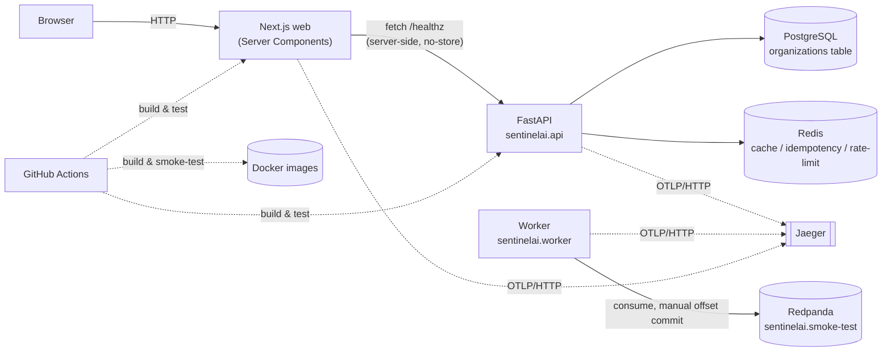

# Architecture — as built (Milestone 0)

This document describes what exists in this repository *today*. For the
target system and the roadmap to get there, see [`HLD.md`](HLD.md). For why
specific choices were made, see [`adr/`](adr/).

## Runtime topology



Nothing here talks to anything else yet in service of real business logic —
this is the walking skeleton every future feature builds on. Postgres holds
one table. Redis is exercised by tested-but-unused utilities. Kafka carries
one smoke-test topic.

## Repository layout

```
src/sentinelai/
  platform/     cross-cutting infra: config, logging, tracing, db, redis,
                messaging, cache/idempotency/rate-limit utilities, errors
  modules/      bounded contexts (organization/, so far)
  api/          FastAPI app, routes, exception handling
  worker/       Kafka consumer entrypoint
web/            Next.js app (App Router, TypeScript, Tailwind)
migrations/     Alembic revisions
infra/compose/  local dev stack (Postgres, Redis, Redpanda, Jaeger)
infra/docker/   production Dockerfiles
tests/unit/     no external dependencies, run on every `make check`
tests/integration/  real Postgres/Redis/Kafka, run via `make test-integration`
```

## Module boundaries

Enforced by import-linter (`pyproject.toml`, `[tool.importlinter]`), checked
by `uv run lint-imports` — part of `make lint` and every CI run:

```
worker, api   (entrypoints / adapters)
      |  may import
      v
modules       (bounded contexts)
      |  may import
      v
platform      (cross-cutting infra; imports nothing above it)
```

See ADR-0001 and ADR-0003.

## Configuration

Every setting is an environment variable, prefixed `SENTINEL_`, typed and
validated by `sentinelai.platform.config.Settings`:

| Variable | Default (local) | Used by |
|---|---|---|
| `SENTINEL_ENVIRONMENT` | `local` | everywhere — gates local-only behavior |
| `SENTINEL_SERVICE_NAME` | `sentinelai-api` | logs, trace resource attributes |
| `SENTINEL_LOG_LEVEL` / `SENTINEL_LOG_JSON` | `INFO` / `true` | `platform/logging.py` |
| `SENTINEL_DATABASE_URL` | points at Compose Postgres | `platform/db.py` |
| `SENTINEL_REDIS_URL` | points at Compose Redis | `platform/redis.py` |
| `SENTINEL_KAFKA_BOOTSTRAP_SERVERS` | points at Compose Redpanda | `platform/messaging.py` |
| `SENTINEL_OTEL_EXPORTER_ENDPOINT` | points at Compose Jaeger | `platform/tracing.py` |

Web reads `API_BASE_URL` (server-only) and `OTEL_EXPORTER_OTLP_ENDPOINT`.

## Request and message flow today

**HTTP:** browser to Next.js Server Component (`getHealth()`) to FastAPI
`/healthz` — no backing services touched. `/readyz` additionally pings
Postgres (`SELECT 1`) and Redis (`PING`); a 503 means "stop routing traffic
here," not "restart me" (liveness/readiness separation, Phase 0.5).

**Kafka:** the worker holds an open consumer on `sentinelai.smoke-test`
(consumer group `sentinelai-worker`), commits offsets manually only after
successful processing (at-least-once, made safe by the idempotency
utilities in `platform/idempotency.py`), and propagates OpenTelemetry trace
context through message headers (`platform/messaging.py`).

## Observability

Every process exports OpenTelemetry traces via OTLP/HTTP to Jaeger
(`http://localhost:16686` locally). FastAPI, SQLAlchemy, and Redis calls are
auto-instrumented; the Kafka hop is manually instrumented (no standard
auto-instrumentation point exists for it). Every structured log line carries
`trace_id`/`span_id` from whatever span is active when it's written.

## CI/CD

`.github/workflows/ci.yml` runs five independent jobs on every push: Python
lint/types/unit-tests, Python integration tests (real Postgres/Redis/Kafka,
started from the same Compose file used locally), web lint/types/tests/build,
generated-API-types drift detection, and Docker image build + smoke test.

## What's explicitly not built yet

No incident domain, no anomaly detection, no RAG, no AI agent, no
remediation engine, no authentication, no Kubernetes manifests, no Terraform,
no cloud deployment. These begin at Milestone 1 onward — see
[`HLD.md`](HLD.md)'s roadmap.
